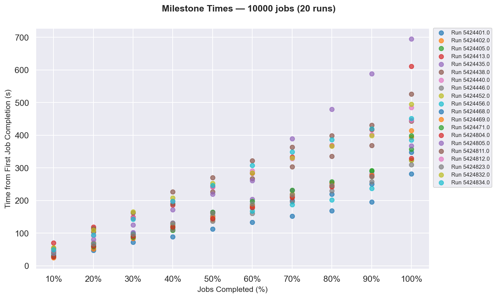
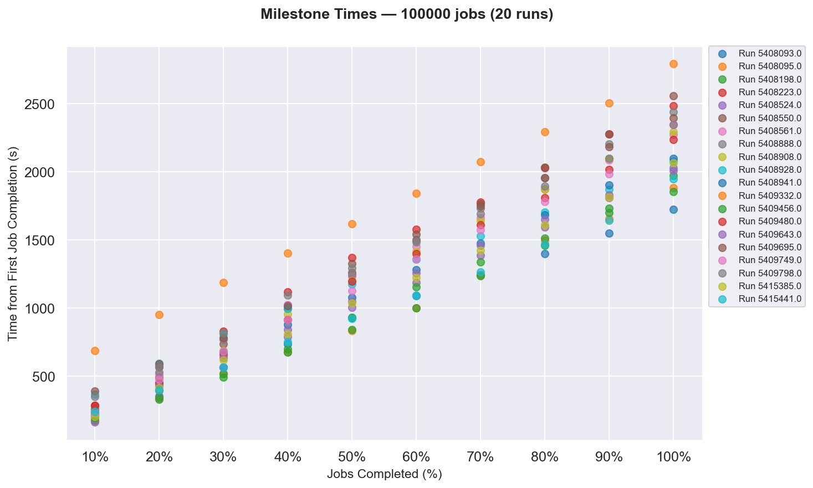

```{r setup, include=FALSE}
knitr::opts_chunk$set(echo = FALSE, warning = FALSE, message = FALSE)
```

# Objective

Profile the error of Monte Carlo numerical integration as an estimator of π as
a function of the total number of samples *N*. By submitting *J* independent
HTCondor jobs, each producing a fixed number of samples *S*, and accumulating
results in chronological order of job completion, we observe how the absolute
estimation error decreases as *N* grows — and how job throughput and
turnaround behave as *J* scales from 10 to 100,000.

# Background

The Monte Carlo method estimates π by exploiting the ratio of the area of a
unit circle to its enclosing unit square. For a point $(x, y)$ drawn uniformly
from $[0,1) \times [0,1)$, the point falls inside the quarter-circle if:

$$x^2 + y^2 < 1$$

The fraction of points satisfying this condition converges to $\pi/4$ as the
number of samples grows. Multiplying by 4 gives the estimate of π. The
expected error decreases proportionally to $1/\sqrt{N}$ (the standard Monte
Carlo convergence rate).

# Experiment Parameters

| Parameter | Symbol | Description |
|-----------|--------|-------------|
| Samples per job | S | Fixed number of random points generated by a single job |
| Number of jobs | J | Total jobs submitted; controls total samples N = S × J |
| Total samples | N | Cumulative sample count after j jobs: N = S × j |
| Reference value of π | π_ref | High-precision reference, 3.14159265358979323846... |
| Absolute error | ε | \|π_estimated − π_ref\| |

# Job Design

Each HTCondor job is a self-contained execution unit that:

- Sets the random seed based on the job number (ProcID) and cluster number (ClusterID)
- Generates exactly S random $(x, y)$ pairs uniformly distributed in $[0,1) \times [0,1)$
- Counts the number of points M satisfying $x^2 + y^2 < 1$
- Computes a local estimate: $\pi_{local} = 4M/S$
- Writes a single output file to the Access Point upon completion (the script writes no output if it errors)
- Sleeps for a duration (1–60s) **assigned at submit time** before exiting, to stagger completion times (see *Sleep-time assignment* under *Next Steps*)

A job is considered **done** if and only if its output file exists at the
Access Point *and* there is a corresponding `JOB_TERMINATED` entry for that
Job ID in the HTCondor log. All jobs within an experiment request identical
CPU, memory, disk, clock-time limit, and execution environment, so differences
in completion time reflect scheduling and pool variation rather than resource
differences.

## Worker script: `mc_pi.py`

```python
python mc_pi.py <S> <ProcID> <ClusterID>
```

**How seeding works:** the seed is derived from `MD5(ClusterID_ProcID)` mapped
to a 32-bit integer, guaranteeing that no two `(ClusterID, ProcID)` pairs
share a seed — every job produces statistically independent samples, even
across multiple submission clusters.

**Output** (`output_<ProcID>.txt`):

```
job_id=<ProcID>
cluster_id=<ClusterID>
seed=<seed>
samples=<S>
hits=<M>
pi_estimate=<4*M/S>
```

## Submit file: `mc_pi.sub`

Submits *J* independent jobs to HTCondor, each running
`mc_pi.py <S> $(Process) $(Cluster)`. With submit-side sleep assignment, the
submit file queues from the pregenerated job-parameter table
(`queue sleep_time from <table>`) so each job's sleep duration arrives as an
argument. Output, error, and log files are organized per-cluster under
`run_$(Cluster)/logs/`, and result files are transferred back and remapped
into the same folder.

# Pipeline

```
1. condor_submit mc_pi.sub                → run_<ClusterID>/ created
2. condor_wait .../mc_pi.log               → wait for all jobs to terminate
3. mv run_<ClusterID> mc_runs_<J>/         → file under the right job-count bucket
4. python make_graphs.py <J>               → aggregate + plot in one step
5. python milestone_times.py               → percentile completion times, all job counts
6. python milestone_scatter.py             → milestone comparison plots
```

`make_graphs.py` (parameterized by job count `J`):

1. Aggregates any `run_*` folders in `mc_runs_<J>/` lacking a `results.csv`:
   parses each `output_<job_id>.txt`, cross-references the HTCondor log for
   termination timestamps, keeps only jobs with both a valid output file and
   a `JOB_TERMINATED` entry, sorts by completion time, and computes running
   cumulative π estimate and absolute error.
2. Produces four plots per run under `graphs/<J>_jobs/`:
   - `mc_runs_<J>_scatter.png` — π estimate vs. cumulative jobs, and log-log error vs. N
   - `mc_runs_<J>_runtime.png` — cumulative samples vs. wall-clock time
   - `mc_runs_<J>_runtime_jobs.png` — cumulative jobs completed vs. wall-clock time
   - `mc_runs_<J>_turnaround.png` — per-job turnaround time vs. Job ID

`results.csv` columns: `j`, `job_id`, `submit_time`, `timestamp`,
`turnaround_s`, `N`, `pi_est`, `error`.

# Results

Experiments were run at five scales: **10, 100, 1,000, 10,000, and 100,000**
jobs, each with S = 10,000 samples per job.

## Cross-scale comparison

To compare throughput across job counts on a common footing,
`milestone_times.py` records the wall-clock time (from first job completion)
at which each 10% completion milestone was reached, for every run at every
job count, and `milestone_scatter.py` plots the pooled results.

```{r fig-milestones-10000, out.width="100%"}

```

```{r fig-milestones-100000, out.width="100%"}

```

# Files in `monte_carlo_pi/`

| File | Role |
|------|------|
| `mc_pi.py` | Worker script: generates S samples, writes `output_<ProcID>.txt` |
| `mc_pi.sub` | HTCondor submit file (`queue J`) |
| `aggregate.py` | Original aggregation script (reads `mc_runs/`) |
| `graph.py` | Original convergence plot script (reads `mc_runs/`) |
| `runtime_graph.py` | Runtime + turnaround plots (reads `mc_runs/`, the original 100-job experiment) |
| `make_graphs.py` | All-in-one aggregate + plot, parameterized by job count |
| `milestone_times.py` | Extracts percentile completion times across all job counts → `milestone_times.csv` |
| `milestone_scatter.py` | Plots `milestone_times.csv` |
| `utils.py` | Shared helper: `get_run_folders()` |
| `examples/` | Sample output files + parse test, for testing without HTCondor |

# Caveats

> Running a large number of jobs can impact user priority relative to other
> users on the pool, reducing throughput via fair-share balancing. For
> reproducible comparisons across scales, user priority should be reset
> between runs.

# Next Steps

## Sleep-time assignment: submit-side seed chain

Rather than letting each job pick its own seed for the sleep duration, the
sleep times are generated **once, on the submit side**, and passed to each job
as an explicit parameter. This keeps the full experiment under our control and
makes every run exactly reproducible from a single starting seed.

The seeds form a deterministic chain via a recurrence:

$$R_i = f(R_{i-1})$$

Starting from a single initial seed $R_0$, the recurrence is applied
repeatedly to produce one value per job - e.g. 100,000 values for a
100,000-job run. Each $R_i$ is then mapped to a sleep duration in the 1–60 s
range and written into a job-parameter table. The submit file iterates over
this table (`queue sleep_time from <table>`), so each job receives its sleep
duration as an argument instead of computing it internally.

Why this matters:

- **Control:** the submitter, not the job, decides every sleep time; the
  experiment's completion-time staggering is fully specified before any job runs.
- **Reproducibility:** one starting seed $R_0$ regenerates the entire sequence
  of sleep times, for any number of jobs.
- **Independence from the sampling seed:** the Monte Carlo sampling seed
  (derived from `ClusterID`/`ProcID`) and the sleep duration are decoupled, so
  changing the staggering scheme never perturbs the π estimates.

## Memory Profiling

We observed that users are requesting a lot of memory while running jobs and
it takes longer for jobs to move through the system.
**Understanding how throughput changes with memory requests.**

Why do we care about memory?

- Ask for too much → fewer machines can fit your job → longer waits
- Ask for too little → job can get kicked off or put on hold
- So memory requests directly change how many jobs finish per hour

What we'll do:

- Run the same workload with different memory requests, varying
  `request_memory` for each run from **500 MB to 64 GB**
- Measure how throughput changes
